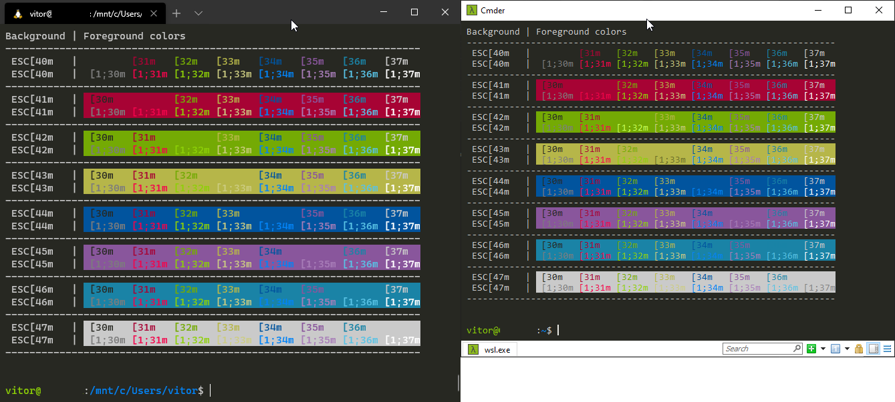

# Monokai Cmder for Windows Terminal

Attempt to recreate Cmder color scheme as close as possible on Windows Terminal.

## Comparison



## Installing

All steps are optional and can be modified to your desire.

Open Windows Terminal `settings.json` file from its menu

### 1. Add Monokai Cmder color scheme

Paste the following inside `schemes`

```json
{
  "name": "Monokai Cmder",

  "cursorColor": "#FFFFFF",
  "selectionBackground": "#cccc81",

  "background": "#272822",
  "foreground": "#cacaca",

  "black": "#272822",
  "red": "#a70334",
  "green": "#74aa04",
  "yellow": "#b6b649",
  "blue": "#01549e",
  "purple": "#89569c",
  "cyan": "#1a83a6",
  "white": "#cacaca",
  "brightBlack": "#7c7c7c",
  "brightRed": "#f3044b",
  "brightGreen": "#8dd006",
  "brightYellow": "#cccc81",
  "brightBlue": "#0383f5",
  "brightPurple": "#a87db8",
  "brightCyan": "#58c2e5",
  "brightWhite": "#ffffff"
}
```

### 2. Set default Color Scheme and Font Face

Paste the following inside `profiles > defaults`

```json
// optional:  add this line if you want to use Monokai Cmder
//            globally on all profiles
"colorScheme": "Monokai Cmder"

// optional:  add this line if you want to use Consolas
//            globally on all profiles
"fontFace": "Consolas"
```

### 3. Integrate Cmder into Windows Terminal

Paste the following code as a item in `profiles > list`.
You should have `%cmder_root%` environment variable set, or just modify the code bellow accordingly.

```json
{
  "guid": "{d41ee793-1255-4694-b5a6-1f69bd94dc09}",
  "name": "Cmder",
  "commandline": "cmd.exe /k %cmder_root%/vendor/init.bat",
  "icon": " %cmder_root%/icons/cmder.ico",
  "hidden": false,
  "colorScheme": "Monokai Cmder",
  "fontFace": "Consolas"
}
```

### 4. Set Cmder as default profile

Change `defaultProfile` to `{d41ee793-1255-4694-b5a6-1f69bd94dc09}`.

```json
"defaultProfile": "{d41ee793-1255-4694-b5a6-1f69bd94dc09}",
```
